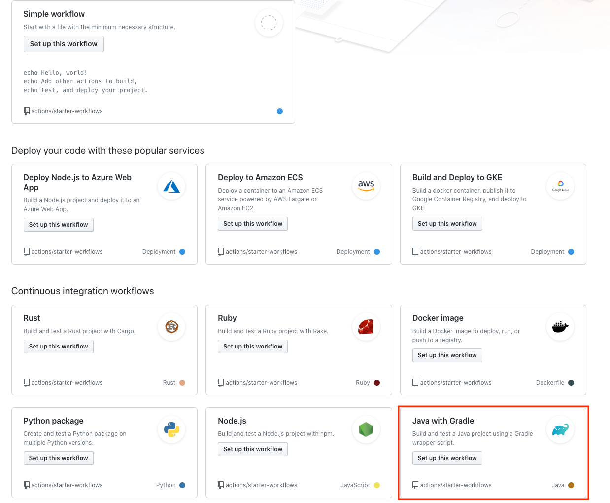
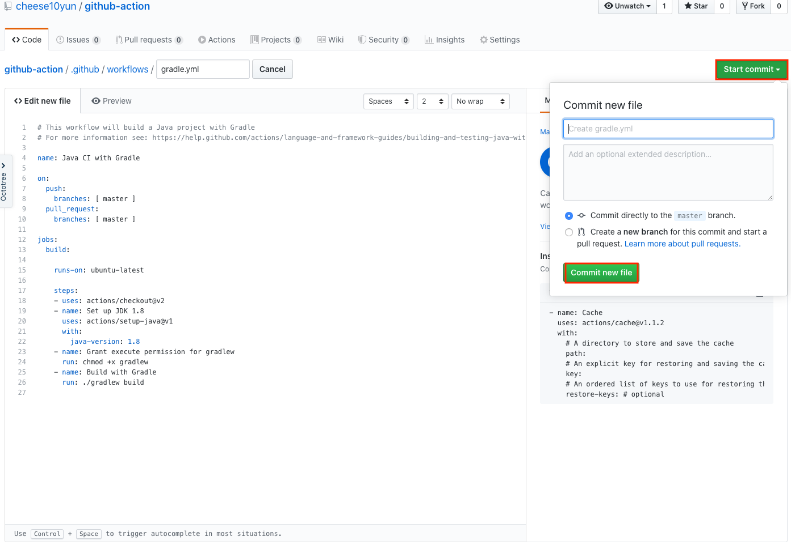

<<<<<<< HEAD
# Github Action With Spring Boot & Gradle

## Github Action

Github Action을 통해서 깃허브 자체적으로 CI & CD를 진행할 수 있습니다. Github에대한 자세한 설명은 [공식홈페이지](https://github.com/features/actions)를 참고 해주세요. 본 포스팅에서는 Spring Boot & Gradle 환경에서 간단한 빌드를 다룰 예정입니다.

## Github Action 만들기

Github Repository 상단에 `Actions`을 클릭 합니다.

Java With Gradle Action의 `Set up this workflow` 버튼을 클릭합니다.

`Java With Gradle Action`의 YML을 생성합니다.

=======
# github-action

>>>>>>> 21a8c1dd19b5414752e098f52c9bab48416f5c3a
