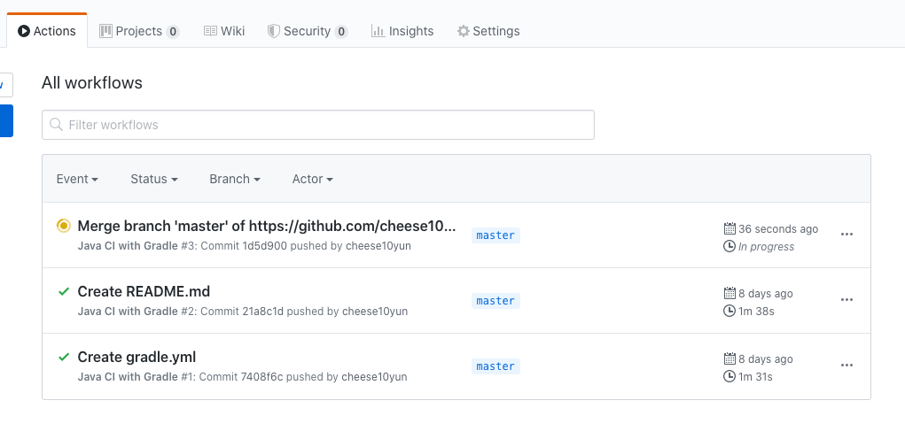
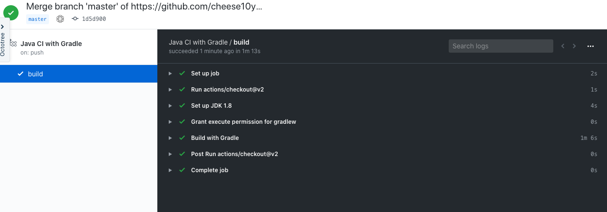
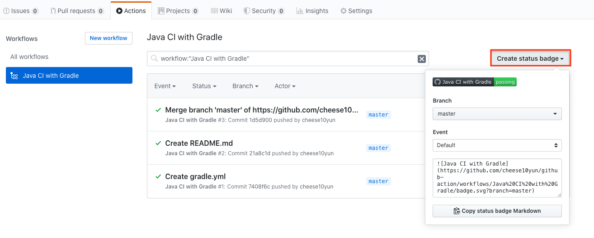

# Github Action With Spring Boot & Gradle

## Github Action

Github Action을 통해서 깃허브 자체적으로 CI & CD를 진행할 수 있습니다. Github에대한 자세한 설명은 [공식홈페이지](https://github.com/features/actions)를 참고 해주세요. 본 포스팅에서는 Spring Boot & Gradle 환경에서 간단한 빌드를 다룰 예정입니다.


## Github Action 만들기

Github Repository 상단에 `Actions`을 클릭 합니다.


Java With Gradle Action의 `Set up this workflow` 버튼을 클릭합니다.


`Java With Gradle Action`의 YML을 생성합니다.

### gradle.yml

```yml
name: Java CI with Gradle

on:
  push:
    branches: [ master ]
  pull_request:
    branches: [ master ]

jobs:
  build:

    runs-on: ubuntu-latest

    steps:
    - uses: actions/checkout@v2
    - name: Set up JDK 1.8
      uses: actions/setup-java@v1
      with:
        java-version: 1.8
    - name: Grant execute permission for gradlew
      run: chmod +x gradlew
    - name: Build with Gradle
      run: ./gradlew build
```

`on.push`, `on.pull_request`을 보면 `master` branch에 `push`, `pull_request` 이벤트가 발생하는 경우 해당 `jobs`가 실행됩니다. `build`에서는 JDK 설정, Gradle 설정을 진행하고 최종적으로 `./gradlew build` 진행합니다.


### Action Workflows



`master`에 `push`, `pull_request` 이벤트가 발생할 경우 해당 Github Action이 동작하게 됩니다.



Event를 클릭하면 상세 Github Actuon에 대한 내용을 살펴볼 수 있습니다.

### Badge 




오른쪽 상단에 `Create status badge` 버튼을 클릭해서 Badge를 Markdown Copy를 진행할 수 있습니다. 